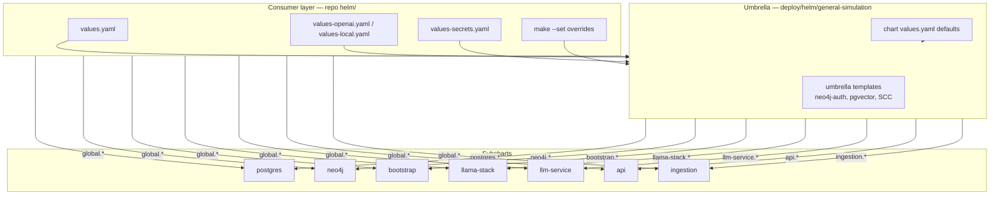

# Values mapping reference

How Helm values flow from a **consumer** install into the `general-simulation`
umbrella chart and its subcharts.

For quick-start commands see [`helm/README.md`](helm/README.md). Chart templates
live under [`deploy/helm/general-simulation/`](deploy/helm/general-simulation/).

---

## Mental model



Helm merges values **depth-first**: subchart defaults → umbrella defaults →
each `-f` file in order → `--set` / `--set-string` (highest priority).

---

## Value file inventory

| File | Role | Committed? |
|------|------|------------|
| [`deploy/helm/general-simulation/values.yaml`](deploy/helm/general-simulation/values.yaml) | Minimal defaults shipped inside the published chart `.tgz` | Yes |
| [`helm/values.yaml`](helm/values.yaml) | **Primary consumer config** for standalone deploy from this repo | Yes |
| [`helm/values-openai.yaml`](helm/values-openai.yaml) | LLM mode overlay (`LLM_MODE=openai`) | Yes |
| [`helm/values-local.yaml`](helm/values-local.yaml) | LLM mode overlay (`LLM_MODE=local`) | Yes |
| [`helm/values-secrets.yaml`](helm/values-secrets.yaml) | Passwords and API tokens | **No** (gitignored) |
| [`helm/values-secrets.yaml.example`](helm/values-secrets.yaml.example) | Template for secrets file | Yes |
| `deploy/helm/<subchart>/values.yaml` | Per-subchart defaults when chart is rendered alone | Yes |

**Rule of thumb:** edit `helm/values.yaml` (and overlays) for day-to-day deploys.
Only change `deploy/helm/general-simulation/values.yaml` when you want new
**published chart** defaults.

---

## Standalone install: merge order

`make deploy` (see [`Makefile`](Makefile)) runs:

```text
helm upgrade --install general-simulation ./deploy/helm/general-simulation \
  -f helm/values.yaml \
  [-f helm/values-<LLM_MODE>.yaml]    # skipped when LLM_MODE=maas (default)
  [-f helm/values-secrets.yaml]     # if file exists
  --set global.registry=...
  --set global.imageTag=...
  --set global.images.app=...
  --set global.images.postgres=...
  [--set-string global.postgres.password=...]   # only when make/env overrides file
  [--set-string global.neo4j.password=...]
  [--set-string global.models.*.apiToken=...]   # mode-dependent
```

### Secret resolution (`helm/resolve-deploy-secrets.sh`)

| Priority | Source | Example |
|----------|--------|---------|
| 1 (highest) | Non-empty `make` / env var | `make deploy PG_PASSWORD=secret` |
| 2 | `helm/values-secrets.yaml` | `global.postgres.password` |
| — | Required check | Fails if still empty / `CHANGE_ME` |

`--set-string` is emitted **only** for explicit make/env overrides so an empty
`PG_PASSWORD=` does not wipe a value loaded from the secrets file.

| `LLM_MODE` | Required secret | YAML path |
|------------|-----------------|-----------|
| `maas` (default) | `MAAS_API_TOKEN` | `global.models.external-model.apiToken` |
| `openai` | `OPENAI_API_KEY` | `global.models.openai.apiToken` |
| `local` | `HF_TOKEN` | `llm-service.secret.hf_token` |

---

## Umbrella → subchart routing

The umbrella [`Chart.yaml`](deploy/helm/general-simulation/Chart.yaml) declares
dependencies. Each **top-level key** matching a dependency name is passed to
that subchart as its root `.Values` (merged with the subchart's own defaults).

| Parent key (`helm/values.yaml`) | Subchart | `condition` |
|---------------------------------|----------|-------------|
| `postgres` | `postgres` | `postgres.enabled` |
| `neo4j` | `neo4j` (official chart) | `neo4j.enabled` |
| `bootstrap` | `bootstrap` | `bootstrap.enabled` |
| `llama-stack` | `llama-stack` (external) | `llama-stack.enabled` |
| `llm-service` | `llm-service` (external) | `llm-service.enabled` |
| `api` | `api` | `api.enabled` |
| `ingestion` | `ingestion` | `ingestion.enabled` |

Keys with hyphens (`llama-stack`, `llm-service`) must be quoted in YAML:

```yaml
"llama-stack":
  enabled: true
```

### `global` — shared across every subchart

Helm copies `global:` from the parent into **each** subchart's
`.Values.global`. Use it for credentials and image coordinates that many
components need.

```yaml
global:
  registry: quay.io/rh-ai-quickstart
  imageTag: latest
  images:
    app: general-sim-api
    postgres: general-sim-postgres
  postgres:
    host: postgres
    password: ""      # set via secrets file or --set-string
  neo4j:
    host: neo4j
    password: ""
  models:             # consumed by llama-stack subchart
    external-model:
      enabled: true
      apiToken: ""
```

---

## `global` and subchart-local fallbacks

First-party subcharts (`postgres`, `bootstrap`, `api`, `ingestion`) resolve
credentials with the same pattern in their `_helpers.tpl`:

```text
coalesce(.Values.<local>, .Values.global.<same>)
```

| Field | Subchart-local path | Global fallback | Used by |
|-------|---------------------|-----------------|---------|
| Postgres password | `postgres.password` | `global.postgres.password` | postgres, bootstrap, api, ingestion |
| Postgres user | `postgres.user` / `postgres.username` | `global.postgres.user` | all above |
| Postgres host | `postgres.host` | `global.postgres.host` | bootstrap, api, ingestion |
| Neo4j password | `neo4j.password` | `global.neo4j.password` | bootstrap, api, ingestion |
| Neo4j host | `neo4j.host` | `global.neo4j.host` | bootstrap, api, ingestion |
| App image | `image` (full ref) | `global.registry` + `global.images.app` + `global.imageTag` | bootstrap, api, ingestion |
| Postgres image | `image` (full ref) | `global.registry` + `global.images.postgres` + `global.imageTag` | postgres |

**Recommended:** set passwords once under `global.postgres.password` and
`global.neo4j.password`. Subchart-local `postgres.password` / `neo4j.password`
still work for per-component overrides.

---

## Umbrella-only templates

These resources are rendered by the **parent** chart (not a subchart) and read
umbrella-level `.Values`:

| Template | Reads | Creates |
|----------|-------|---------|
| [`neo4j-auth-secret.yaml`](deploy/helm/general-simulation/templates/neo4j-auth-secret.yaml) | `global.neo4j.password` | Secret `neo4j-auth` for official Neo4j chart |
| [`llamastack-pg-secret.yaml`](deploy/helm/general-simulation/templates/llamastack-pg-secret.yaml) | `global.postgres.*`, `postgres.postgres.*` | Secret `pgvector` for Llama Stack |
| [`neo4j-serviceaccount.yaml`](deploy/helm/general-simulation/templates/neo4j-serviceaccount.yaml) | `openshift.neo4j.scc.enabled` | OpenShift SA |
| [`neo4j-scc-binding.yaml`](deploy/helm/general-simulation/templates/neo4j-scc-binding.yaml) | `openshift.neo4j.scc.enabled` | SCC binding |

---

## LLM modes (`llm.mode`)

`llm.mode` in [`helm/values.yaml`](helm/values.yaml) is a **documentation
convention** for humans and `make deploy`; no umbrella template branches on it
directly. Mode is implemented by **which overlay file and keys are enabled**:

| Mode | Overlay file | `llm-service.enabled` | Active `global.models` provider | `api.models.generation` |
|------|--------------|----------------------|--------------------------------|-------------------------|
| `maas` | *(none)* | `false` | `external-model` | `external-model/llama-scout-17b` |
| `openai` | `values-openai.yaml` | `false` | `openai` | `openai/gpt-4o-mini` |
| `local` | `values-local.yaml` | `true` | `deepseek-r1-distill-qwen-1-5b` | `deepseek-r1-distill-qwen-1-5b/deepseek-ai/...` |

### Inference path (always via Llama Stack)

```text
api / ingestion  →  http://llamastack:8321/v1  →  upstream provider
                     (api.llm.baseUrl)            (global.models.* in llama-stack)
```

| Consumer key | Subchart | Runtime env / secret |
|--------------|----------|----------------------|
| `api.llm.baseUrl` | `api` | `LLM_BASE_URL` in ConfigMap |
| `api.models.generation` | `api` | `GENERATION_MODEL_ID` |
| `api.models.embedding` | `api` | `EMBEDDING_MODEL_ID` |
| `ingestion.models.*` | `ingestion` | same pattern in CronJob / hook Job |
| `global.models.*` | `llama-stack` | provider registration + tokens |

---

## Subchart reference

### `postgres`

| Consumer / parent key | Subchart `.Values` | Kubernetes output |
|-----------------------|-------------------|-------------------|
| `postgres.enabled` | `enabled` | Install toggle |
| `global.postgres.password` | via helper | Secret `postgres-credentials` |
| `global.images.postgres` | via helper | StatefulSet image |
| `postgres.storage.size` | `storage.size` | PVC size |

### `neo4j` (official chart)

| Consumer / parent key | Effect |
|-----------------------|--------|
| `neo4j.enabled` | Install toggle |
| `neo4j.fullnameOverride: neo4j` | Service name `neo4j` |
| `neo4j.neo4j.passwordFromSecret: neo4j-auth` | Uses umbrella-created secret |
| `global.neo4j.password` | Umbrella → `neo4j-auth` Secret |

### `bootstrap`

| Consumer / parent key | Subchart `.Values` | Effect |
|-----------------------|-------------------|--------|
| `bootstrap.enabled` | `enabled` | Install toggle |
| `bootstrap.waitFor.*` | `waitFor.*` | Init container TCP wait |
| `global.postgres.*`, `global.neo4j.*` | via helpers | `POSTGRES_DSN`, `NEO4J_*` env |
| `global.images.app` | via helper | `bootstrap-schema` image |

Helm hook: `post-install`, `post-upgrade` (schema Job).

### `llama-stack` (external)

| Consumer / parent key | Effect |
|-----------------------|--------|
| `"llama-stack".enabled` | Install toggle |
| `"llama-stack".rawDeploymentMode` | Deployment style |
| `"llama-stack".pgvector.enabled` | Umbrella creates `pgvector` Secret |
| `global.models` | Provider config passed through `global` |

### `llm-service` (external, local mode only)

| Consumer / parent key | Effect |
|-----------------------|--------|
| `llm-service.enabled` | Install toggle |
| `llm-service.secret.hf_token` | Hugging Face token |
| `llm-service.models.*` | vLLM model spec |
| `global.models.deepseek-r1-distill-qwen-1-5b` | Must align with Stack provider key |

### `api`

| Consumer / parent key | Subchart `.Values` | Runtime |
|-----------------------|-------------------|---------|
| `api.enabled` | `enabled` | Install toggle |
| `api.route.enabled` | `route.enabled` | OpenShift Route `general-sim-api` |
| `api.models.generation` | `models.generation` | `GENERATION_MODEL_ID` |
| `api.waitFor.*` | `waitFor.*` | Init wait + startup probe budget |
| `global.postgres.*`, `global.neo4j.*` | via helpers | Secret `app-secrets` |

### `ingestion`

| Consumer / parent key | Subchart `.Values` | Runtime |
|-----------------------|-------------------|---------|
| `ingestion.enabled` | `enabled` | CronJob install toggle |
| `ingestion.schedule` | `schedule` | Cron schedule (`*/10 * * * *`) |
| `ingestion.runOnDeploy.enabled` | `runOnDeploy.enabled` | Hook Job on install/upgrade |
| `ingestion.adapterId` | `adapterId` | `--adapter` CLI arg |
| `ingestion.models.generation` | `models.generation` | Container env |
| `global.postgres.*`, `global.neo4j.*` | via helpers | Job / CronJob env |

Hook Job `general-sim-ingestion-initial` runs at `hook-weight: 10` (after
bootstrap at weight `0`).

---

## Consuming `general-simulation` as a parent subchart

When another application depends on this chart, values are nested under the
dependency **name** (`general-simulation`):

```yaml
# parent-app/Chart.yaml
dependencies:
  - name: general-simulation
    version: 0.0.1
    repository: https://robertsandoval.github.io/general-simulation
    condition: general-simulation.enabled

# parent-app/values.yaml
general-simulation:
  enabled: true

  global:
    postgres:
      password: "from-parent-vault"
    neo4j:
      password: "from-parent-vault"
    models:
      external-model:
        apiToken: "from-parent-vault"

  api:
    enabled: true
    route:
      enabled: false    # parent exposes its own ingress

  ingestion:
    enabled: true
```

Everything under `general-simulation:` follows the same routing rules as
standalone `helm/values.yaml`, but prefixed one level.

Cross-namespace clients call the API at:

```text
http://general-sim-api.<release-namespace>.svc:8000
```

---

## Common overrides

### Post-deploy smoke test (UK airspace closure)

```bash
SEED_MODE=cluster NAMESPACE=general-simulation make smoke-test
```

### Skip immediate ingestion on deploy

```yaml
ingestion:
  runOnDeploy:
    enabled: false
```

### Kind / plain Kubernetes (no OpenShift Routes)

```yaml
openshift:
  neo4j:
    scc:
      enabled: false
api:
  route:
    enabled: false
```

### Custom image registry

```yaml
global:
  registry: quay.io/my-org
  imageTag: v1.2.3
  images:
    app: my-general-sim-api
    postgres: my-general-sim-postgres
```

Or via make: `make deploy REGISTRY=quay.io/my-org TAG=v1.2.3`.

---

## Debugging values

```bash
# Effective values after install
helm get values general-simulation -n general-simulation

# Render a subchart template with consumer files
helm template test ./deploy/helm/general-simulation \
  -f helm/values.yaml \
  -f helm/values-secrets.yaml \
  --show-only charts/api/templates/configmap.yaml

# See what a subchart receives (Helm 3)
helm template test ./deploy/helm/general-simulation \
  -f helm/values.yaml \
  --show-only charts/api/templates/deployment.yaml
```

---

## Related docs

| Doc | Contents |
|-----|----------|
| [`helm/README.md`](helm/README.md) | Quick start, secret files, LLM modes |
| [`deploy/helm/general-simulation/README.md`](deploy/helm/general-simulation/README.md) | Umbrella install, component toggles, publishing |
| [`frontend_ui/README.md`](frontend_ui/README.md) | Simulation Console (WIP; not shipped in API image) |
| [`Makefile`](Makefile) | `make deploy`, per-component targets, image vars |
