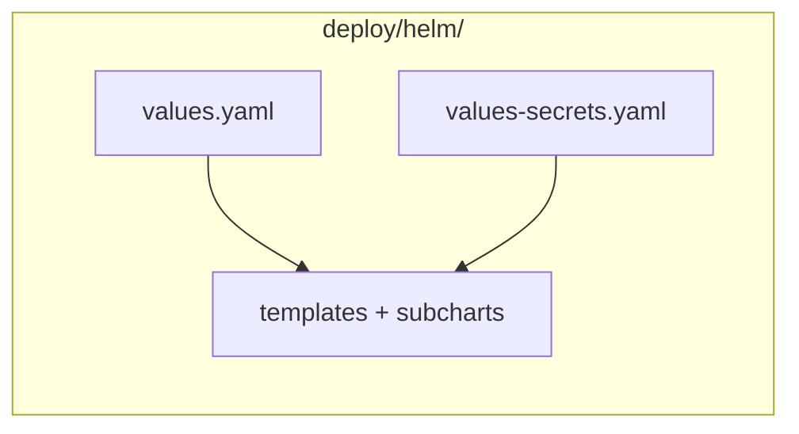
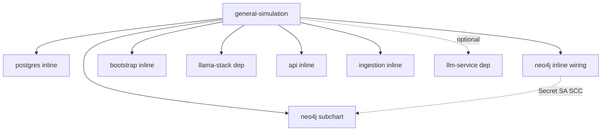

# Values mapping reference

How Helm values flow through the `general-simulation` umbrella chart and its
subcharts.

For quick-start commands see [`deploy/helm/README.md`](../deploy/helm/README.md). The chart
lives at [`deploy/helm/`](../deploy/helm/).

---

## Mental model

### 1. Single chart directory



All chart templates and default values live under **`deploy/helm/`**. Edit
`deploy/helm/values.yaml` for day-to-day config; put secrets in
`deploy/helm/values-secrets.yaml` (gitignored).

### 2. Chart → components

Postgres, neo4j (OpenShift wiring), bootstrap, API, and ingestion are **inline
templates** under `deploy/helm/templates/`. External subchart dependencies: the Neo4j
database (`neo4j/neo4j` chart), llama-stack, and llm-service.



Enable providers via `global.models.<key>.enabled`. Set `llm-service.enabled`
for in-cluster vLLM.

### 3. Scoped vs global keys

**Scoped** — e.g. `api.route.enabled` only affects the API chart.  
**Global** — e.g. `global.postgres.password` is copied into each subchart's
`.Values.global`.

### Merge priority (later wins)

```text
subchart defaults  →  deploy/helm/values.yaml  →  deploy/helm/values-secrets.yaml  →  --set
```

---

## Standalone install

`make deploy` requires `deploy/helm/values-secrets.yaml` and runs:

```text
helm upgrade --install general-simulation ./helm \
  -f deploy/helm/values-secrets.yaml \
  [--set global.registry=...]   # optional image overrides from make CLI
```

Chart `values.yaml` is loaded automatically (no `-f` needed).

### Required secrets

Set passwords and tokens in `deploy/helm/values-secrets.yaml`. Helm validates at
template time via `required` in `templates/_helpers.tpl`.

| Condition | YAML path |
|-----------|-----------|
| Always | `global.postgres.password` |
| Always | `global.neo4j.password` |
| `global.models.external-model.enabled` + `url` set | `global.models.external-model.apiToken` |
| `global.models.nomic.enabled` + `url` set | `global.models.nomic.apiToken` |
| `global.models.openai.enabled` + `url` set | `global.models.openai.apiToken` |
| `llm-service.enabled` | `llm-service.secret.hf_token` |

---

## Value file inventory

| File | Role | Committed? |
|------|------|------------|
| [`deploy/helm/values.yaml`](../deploy/helm/values.yaml) | **Default config** (bundled in published `.tgz`) | Yes |
| [`deploy/helm/values-secrets.yaml`](../deploy/helm/values-secrets.yaml) | Passwords and API tokens | **No** (gitignored) |
| [`deploy/helm/values-secrets.yaml.example`](../deploy/helm/values-secrets.yaml.example) | Template for secrets file | Yes |

---

## Component routing

Top-level keys `postgres`, `bootstrap`, `api`, `ingestion` configure inline
templates (guarded by `<component>.enabled`). External deps use the same keys
for subchart values.

| Parent key | Renders | `enabled` guard |
|------------|---------|-----------------|
| `postgres` | Inline StatefulSet, Services, SCC (`templates/postgres/`) | `postgres.enabled` |
| `openshift.neo4j` | Inline Secret, SA, SCC (`templates/neo4j/`) | `neo4j.enabled` + `openshift.neo4j.scc.enabled` (SA/SCC) |
| `bootstrap` | Inline schema Job (hook) | `bootstrap.enabled` |
| `api` | Inline Deployment, Service, Route | `api.enabled` |
| `ingestion` | Inline CronJob + hook Job | `ingestion.enabled` |
| `neo4j` | External Neo4j StatefulSet subchart | `neo4j.enabled` |
| `llama-stack` | External subchart | `llama-stack.enabled` |
| `llm-service` | External subchart | `llm-service.enabled` |

---

## Model providers

Enable providers in `global.models.<key>.enabled`. Point
`api.models.generation` at `<providerKey>/<model.id>`. Most api/bootstrap/postgres
settings default in `templates/_helpers.tpl`.

### Inference path (always via Llama Stack)

```text
api / ingestion  →  http://llamastack:8321/v1  →  upstream provider
```

### Embeddings (inline sentence-transformers)

Embeddings run inside the Llama Stack pod via the built-in
`sentence-transformers` provider. The umbrella chart overrides subchart
`run-config` to register the embedding model for `/v1/embeddings` (the
subchart alone only sets the vector-store default).

| Role | `api.models.*` | Provider |
|------|----------------|----------|
| Chat | `generation: external-model/llama-scout-17b` | `external-model` (MaaS) |
| Embed | `embedding: sentence-transformers/nomic-ai/nomic-embed-text-v1.5` | `sentence-transformers` (inline) |

Set `url` explicitly for every remote chat provider. Without `url`, the chart
defaults to in-cluster `http://<key>-vllm.<namespace>.svc.cluster.local/v1`.

---

## Umbrella-only templates

| Template | Reads | Creates |
|----------|-------|---------|
| [`neo4j/secret.yaml`](../deploy/helm/templates/neo4j/secret.yaml) | `global.neo4j.password` | Secret `neo4j-auth` |
| [`neo4j/serviceaccount.yaml`](../deploy/helm/templates/neo4j/serviceaccount.yaml) | `openshift.neo4j.scc.enabled` | OpenShift SA `neo4j-sa` |
| [`neo4j/scc-binding.yaml`](../deploy/helm/templates/neo4j/scc-binding.yaml) | `openshift.neo4j.scc.enabled` | SCC ClusterRoleBinding |
| [`llamastack-pg-secret.yaml`](../deploy/helm/templates/llamastack-pg-secret.yaml) | `global.postgres.*` | Secret `pgvector` |
| [`llamastack-run-config.yaml`](../deploy/helm/templates/llamastack-run-config.yaml) | `api.models.embedding`, `global.models.*` | ConfigMap `general-sim-llamastack-config` (mounted by llama-stack) |

---

## Consuming as a parent subchart

Nest values under `general-simulation:` — same routing as standalone
`deploy/helm/values.yaml`.

---

## Debugging values

```bash
helm get values general-simulation -n general-simulation

helm template test ./helm \
  -f deploy/helm/values-secrets.yaml \
  --show-only templates/api/configmap.yaml
```

---

## Related docs

| Doc | Contents |
|-----|----------|
| [`deploy/helm/README.md`](../deploy/helm/README.md) | Quick start, model providers, secrets |
| [`Makefile`](Makefile) | `make deploy`, per-component targets |
| [`README.md`](README.md) | Full OpenShift deployment guide |
